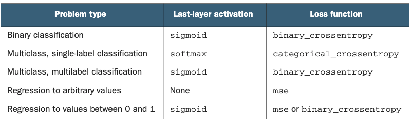
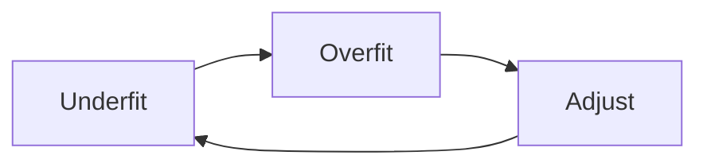

---
export_on_save:
    html: true
title: The Deep Learning Workflow
image: https://i.pinimg.com/236x/14/03/45/14034516662c3cb933df4b8051470e9c--cartoons-architects.jpg
description: The workflow behind engineering a neural network
topics: Deep learning workflow and neural network architecture
sources: <i>Deep Learning with Python</i>
publish: True
---

# Workflow

Let's define a blueprint for Machine Learning.  This one applies to Deep Learning as well. 

## Assemble the dataset

This might be a `pd.read_csv`, or it might be more complicated web scraping. 

## Define the Problem 

Binary classification?  Vector regression?  This will define our model architecture or estimators. 

### Nonstationary 

Be warned!  If you want to do something like recommending clothing in ads, that's a *nonstationary* problem.  The season greatly affects it.  In this case, you'd have to do constant training on very recent data.

## Success Measurement

* Balanced classification - ROC AUC 
* Imbalanced classification - F1, precision, recall 
* Multilabel classification - Mean average precision 

When in doubt, don't guess.  Google!  Here's a nice [article](https://towardsdatascience.com/20-popular-machine-learning-metrics-part-1-classification-regression-evaluation-metrics-1ca3e282a2ce) on some helpful ones. 

## Evaluation Protocol 

* Simple hold-out validation - Plenty of data 
* K-Fold - Not enough data
* Iterated K-Fold - I'm in a Data Desert and have no water. 

## Preprocess 

* Vectorization - Dtypes
* Normalization - [0, 1]
* Feature engineering - make the model's life easier with some hard coding 

# Sculpt 

We want to do better than the dumb baseline. 

The choices we have to make: 

* Last-layer activation - output constraints
    * `sigmoid()`
* Loss function - Is this binary classification?  Should we use `mse` for regression? 
    * `binary_crossentropy()`
* Optimized configuration - Which one?  What should it's learning rate be? 
    * `rmsprops`

# Overfit

What?  What type of instruction is this?

We actually want to overfit *eventually*.  Otherwise, we're not getting the most out of our model.  

Start by underfitting, then overfit, and then adjust accordingly.  

The underfitting to overfitting portion, more practically, looks like so: 

1. Add layers
2. Make layers bigger 
3. Train more epochs

# Fine-tuning

Now it's time to regularize and configure our hyperparameters.  This is the 'fine-tuning' part of the process. 

Some things you might do: 

* Add dropout 
* Change the architecture 
* Add L1 or L2 norms 
* Change hyperparameters (learning rate, hidden units)
* Feature engineering 

Note that too much fine-tuning will lead towards information leaks. 

# Evaluate/Predict 

Train your final model with a foolproof metric like iterated K-Fold validation, and predict! 