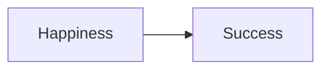

# Preface 

Here's a quote from the book that you **must not forget** before reading these notes. 

> The point is that just reading this book is not enough.  It takes actual focus and effort to put these principles into practice, and only then will the returns start pouring in.  The good news is that these returns are enormous.  

# Success != Happiness

This broken formula states that success will bring us joy.  However, we simply continue to push our goals farther each time we accomplish a new feat.  

> More than a decade of groundbreaking research in the fields of positive psychology has proven that the relationship between success and happiness works the other way around.  Happiness and optimism fuel performance, achievement, and give us the competitive edge - the Happiness Advantage.

# Stats

* Depression rates are 10 times higher than in 19
* The mean onset age of depression continues to decrease logarithmically - 50 years ago, it was 29.5, and now, it's 14.5
* 4 out of 5 students at Harvard are chronically depressed
* Optimistic salespeople outsell their pessimistic counterparts by 56%
* Doctors make more accurate diagnoses, and faster ones, when optimistic

## Cult of the Average

In statistics, outliers are *problems*.  

* Consider training kids to read.  We tailor to the average child, not the faster, nor the slower.

Rather than *deleting the outliers*, we must **study the exceptional**. 

## Negative Focus 

Many positive psychologists focus on the average *and those below average*.  

In the late 90's, there was a **17 to 1** negative-to-positive psychologist ratio. 

However, this leads many to simply reduce or eliminate the negative.  How often do we look at a depressed person and ask "how can we make him optimistic?"  Rather, we say "how can we cure his sadness?"  This is an error. 

> You can study gravity forever without learning how to fly. 

# Med School Syndrome 

The author had to go to a boarding school for "Wellness Weak."  This entailed talks on eating disorders, sicknesses, and risky sex.  That's not a *wellness week*, it's a *sickness week*. 

Focusing on the negative tricks our brains into believing the universe has **negative patterns**. 

Take med students. Being exposed to constant sickness talk, they begin to believe they have all the sicknesses.  The pattern infects their brains.

The takeaway? 

Let's study what works, not what is broken. 

# Comparison 

Harvard students are all in the top 1% of the top 1%.  That is, before they walk into the Ivory Tower. 

> And then they get into Harvard . . . and have a terrible realization: *50 percent of them are suddenly below average.* 
> -- <b>Book</b>

> Comparison is the thief of joy 
> -- <b>Teddy Roosevelt</b>

> We wouldn’t put ourselves in the same class with or compare ourselves to those who are bold enough to make their own recommendations. Certainly, when they measure themselves by themselves and compare themselves to themselves, they show how foolish they are.
> -- <b>2 Corinthians 10:12</b>

> A heart at peace gives life to the body, but envy rots the bones.
> -- <b>Proverbs 14:30</b>

> I like to tell my advisees: If my calculations are correct, 99 percent of Harvard students do not graduate in the top 1 percent.
> -- <b>Book</b>

# Social Aspect

Often, when we're depressed, we shut people out.  I'm guilty of this myself.  Ironically, we do this at the time we need affection the most. 

All those missed calls from dad.  Those angry replies in texts . . . what was I doing? 

> Honor your father and your mother, so that you may live long in the land the Lord your God gave you 
> -- <b>Exodus 20:12</b>

> Based on my study of Harvard undergraduates, the average number of romantic relationships over four years is less than one.
> -- <b>Book</b>

> Countless studies have found that social relationships are the best guarantee of heightened well-being and lowered stress, both an antidote for depression and a prescription for high performance. 
> -- <b>Book</b>

# The Seven Principles 

* **The Happiness Advantage** - Happiness leads us towards success, not the other way around 
* **The Fulcrum and the Lever** - Our mindset is the fulcrum which gives us the power (the lever) to be both more fulfilled and successful 
* **The Tetris Effect** - Seize positive experiences! 
* **Falling Up** - Failure propellant 
* **Zorro Circle** - Manageable goals which won't leave you crushed 
* **The 20-Second Rule** - Small energy adjustments can help us replace bad habits 
* **Social Investment**

# Neuroplasticity 

You **can** change your brain.  You have to make a choice everyday to be happy.  The more you do it, the more effective it will be.  

# Happiness Advantage 

Don't fret on the negative, empower yourself based on what you are grateful for and have already accomplished!

> The most successful people, the ones with the competitive edge, don't look to happiness as some distant reward for their achievements, nor grind through their days on neutral or negative; they are the one who **capitalize on the positive and reap the rewards at every turn**. 

I just love this quote from my dad.  What a great business move from Truess!

> The most memorable moment for me?  My boss bought me dinner.  That's it.  Jim Truess.  Loyalty for life. 
> -- **Scott Anglin** 

An incredible study. 

> One of the most famous longitudinal studies on happiness comes from an unlikely place: the old diaries of Catholic nuns.10 These 180 nuns from the School Sisters of Notre Dame, all born before 1917, were asked to write down their thoughts in autobiographical journal entries. More than five decades later, a clever group of researchers decided to code the entries for positive emotional content. Could their level of positivity as 20-year-olds predict how the rest of their lives turned out? In fact, yes. The nuns whose journal entries had more overtly joyful content lived nearly ten years longer than the nuns whose entries were more negative or neutral. By age 85, 90 percent of the happiest quartile of nuns were still alive, compared to only 34 percent of the least happy quartile.11 Clearly, the nuns who were happy at 20 didn’t feel that way because they knew they would go on to live longer; their superior health and longer life spans could only be the result of their happiness, not the cause.
> -- **Book** 

>Instead of narrowing our actions down to fight or flight as negative emotions do, positive ones broaden the amount of possibilities we process, making us more thoughtful, creative, and open to new ideas. 
> -- **Book**

From a business perspective, invest in your employee's happiness!

> The Happiness Advantage is why cutting-edge software companies have foosball tables in the employee lounge, why Yahoo! has an in-house massage parlor, and why Google engineers are encouraged to bring their dogs to work. These aren’t just PR gimmicks. Smart companies cultivate these kinds of working environments because every time employees experience a small burst of happiness, they get primed for creativity and innovation. They see solutions they might otherwise have missed.
> -- **Book**

Use **happiness priming** to fuel your success.  

* Kids who were told to assemble legoes in elementary school performed better after being told to "think of something that makes them happy."
* Happy-primed children perform better on standardized tests. 

# Priming 

Even the smallest acts of positivity give a massive competitive edge. 

> Doctors who were given candy before their diagnoses (note, they *didn't even get to eat it*), made 20% better diagnoses.

Maybe watch some funny tweets or Reddits before your next presentation! 

# Cultivating Happiness 

> Well, that's great for happy people, but what about the rest of us? 
> -- **Executive** 

Happiness is a work ethic.  

## Strategies

Try to come up with your own, personally-tailored ones.  Here are some good ones, though: 

### Meditate 

One study found that monks who meditated **literally grew the happiness sector of their brain**. 

### Anticipation 

Often, anticipation brings anxiety.  But, if you anticipate **positive events**, like your next vacation, you may find yourself much happier in the valleys of life. 

### Kindness

Committing **concious** acts of kindness is crucial.  The Bible says it, and so does psychology.  

> Individuals told to complete five acts of kindness report feeling much happier than control groups.  If you want to reap the psychological benefit, do this deliberately and conciously . . . you can't declare your acts post hoc. 

> But love your enemies, and do good, and lend, expecting nothing in return, and your reward will be great, and you will be sons of the Most High, for he is kind to the ungrateful and the evil.
> -- **Luke 6:35** 

> Whoever is generous to the poor lends to the Lord, and he will repay him for his deed. 
> -- **Proverbs 19:17** 

> In all things I have shown you that by working hard in this way we must help the weak and remember the words of the Lord Jesus, how he himself said, ‘It is more blessed to give than to receive.’ 
> -- **Acts 20:35**

### Postitive Environments 

Put up pictures of your love ones.  Go outside in nice weather. 

Similarly, *kill negative environments*.  If stocks aren't doing great, don't have CNBC on in the background! 

### Exercise 

A study comparing anti-depressant medication, meditation, and exercise found that exercise single-handedly combatted depression more than all three.  Get those endorphins going! 

### Prosocial Spending 

Spend on experiences, not stuff.  

> People were given 40 dollars.  Half were told to spend it on themselves, while others were told to spend it on others.  At the end of the day, surveys showed those who spent on others were happier. 

> At the end of the month, look back over each column and think about the pleasure each purchase brought you, and for how long. You may quickly find yourself wanting to reapportion money from your 'having' column to your “doing” column.

### Exercise Skills 

What are you good at?  Do that more!  

> When 577 volunteers were encouraged to pick one of their signature strengths and use it in a new way each day for a week, they became significantly happier and less depressed than control groups.
> -- **Book**

The author's example was "love of learning."  Not sure I can think of a better one for myself! 

# Spreading Positivity 

## Workplace 

Spread positivity in the workplace, both for the ROI, and to make yourself and others feel joy. 

> And the bosses who discourage positivity in their employees are at a double disadvantage, because these tend to be people who are most negative themselves. In short, sacrificing positivity in the name of time management and efficiency actually slows us down.
> -- **Book** 

Some proven examples: 

* Google's scooters, ping-pong tables, and more 
* Companies instituting gym memberships and health benefits 
* Patagonia's *Let's go surfing* policy

### Recognition 

*The Order of the Elephant* - in this case, employees gave a stuffed elephant to others when they did something exemplary. 

Don't forget about creative ways to do this, like the Danish elephant example. 

If you ever are a **CEO**, make those employees happy, and find ways to recognize them! 

# Fake til Make 

We often show scowls without even realizing.  Make a concious effort to show your positivity with your facial expression and tone all the time.  You will be rewarded.

## Losada's Ratio 

2.9013.  For every 3 positive actions, you can mullify one negative one.  The more positives you do, the easier it is to get away with screwing up.  And we screw up.  A lot. 

# Fulcrum and the Lever

The sister of the author fell on all fours and broke her bones.  Yet, *the author told her she was a unicorn* and her pain dissipated.  What does this tell us? 

