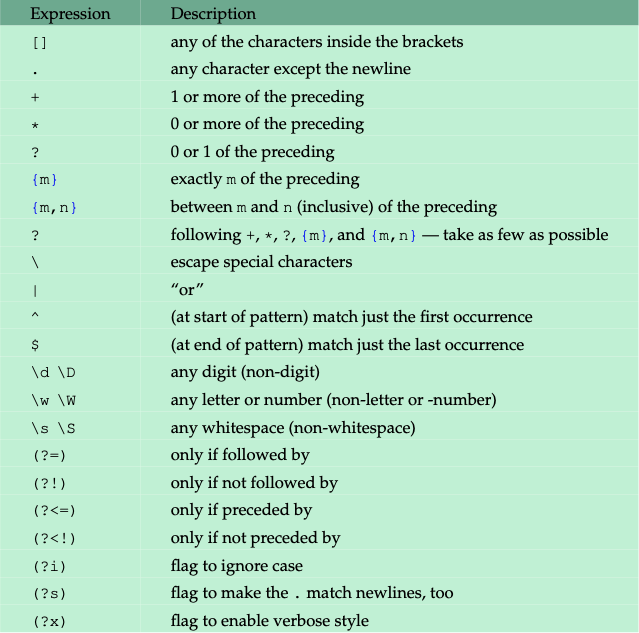
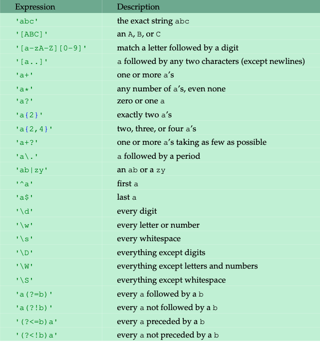

# Help/Docs 

The `help(function)` returns a function's docstring.  

The `dir(module)` gives a list of the functions and variables in a module. 
# Strings

## f-Strings 

[f-Strings](https://realpython.com/python-f-strings/) have a whole host of uses.  A couple common ones are inline bracket notation with evaluated expressions, and also aligning printed content.  

## In 

The `in` operator can be used to see if a character, or sequence of characters, exists in a string.  

```python
if '.html' not in string 
    continue
```

## Split and partition

Essentially the same.  Note that `partition()` requires a delimiter while `split()` does not, and `partition()` returns the delimiter in the output. 

```python
name = 'Luke Anglin' 
split_name = name.split(' ')
partitioned_name = name.partition(' ')
print(f"With split: {split_name}")
print(f"With partition: {partitioned_name}")

>> Output: 
>> With split: ['Luke', 'Anglin']
>> With partition: ('Luke', ' ', 'Anglin')
```

## Slicing

### Iteration by a $c$

One can iterate by a certain amount.  Say we want to iterate every two letters.  

```python 
hello = 'hello'
print(hello[1:len(hello):2])

>> Output: el
```

### Char Change 

Strings are immutable.  Slicing allows us to change a single character. 

The syntax takes the first slice up to the index we want to change.  Then, concatenate the new char, and add the remaining characters.

```python
name = 'Lake'
name_fixed = name[:1] + 'u' + name[2:]
print(name_fixed)
>> Output: Luke
```

# Lists

## Copying 

### Shallow 

A shallow copy is what is generally used.  It copies the references of all sublists.  This is similar to the `copy()` method for other objects. 

```python 
new_list = list_1[:]
```

### Deep 

`deepcopy()` is used when lists are multi-dimensional.  Values are copied, not references.  

## Random 


# Tuples 

Immutable lists.  When is this useful?  Consider a dictionary.  Tuples might be used as the keys.  

```python
grades = { ('Luke', 'five'): 95, . . .}
```

# Sets 

Enclosed in curly braces.  Convert lists to sets with the `set` function. 

```python 
my_set = {1, 2, 3}
a_list = [1, 2, 3, 3, 2, 1]

my_same_set = set(a_list)

```

Note that converting a <span class="keyword1">list to a set</span> will <span class="keyword1">remove all repeats</span>

## Operations 


# Enumerate and Zip

`enumerate` takes some list and returns each value with an indices, in pairs.  `zip` is essentially the opposite.  

Note that **neither produce lists** with tuples.  In order to get a list, you have to use the `list` function.  

One use of `zip` is to create dictionaries from two lists.  

```python
names = ['Luke', 'Casey']
grades = [95, 50]
gradebook = dict(zip(names, grades))
print(gradebook)

>> Output: {'Luke': 95, 'Casey': 50}
```

# Clean Code 

## Assertions to cover your Ass

Consider a bank account.  The withdrawal should *never* be higher than the balance.  Assertions can prevent someone from 'gaming' your code.  

```python 
def withdraw(amount, balance):
    # Do stuff 

    # Make an assertion
    assert 0 <= amount <= balance 

    # Return something
    return "Withdrawed " + str(amount)
```

Now, this statement will generate an `AssertionError`. 

```python 
withdraw(100, 50)
>> AssertionError
```

Keep in mind: 

* **Not** an exception handling mechanism
* Meant to handle *impossible* conditions.

# OS  

## Split 

To retrieve a tuple of the directory and filename, use `split()`

```python
import os

filepath = 'C:/users/lib/run.exe'
os.path.split(filepath)
>> Output: ('C:/users/lib', 'run.exe')
```

## Basename and Dirname

Retrieves *just* the file name (the first index of the `split` function).

```python
import os

filepath = 'C:/users/lib/run.exe'
os.path.basename(filepath)
>> Output: run.exe
```

In contrast, `dirname` returns just the directory (the zero index of the `split` function)

## Walk 

``walk`` is recursive.  It returns a tuple of the `(path, subdirectories, files)` and takes a filepath parameter.  

```python 
for path, dirs, files in os.walk('MLProjects'):
    # Do things
```

## Running

The `.system` function is used to run a program.  
```python 
import os 

# Change directory to where the .exe is located 
os.chdir('usr/evilpath')

# Run it 
os.system('evil.exe')
```

## Quitting 

Maybe I screwed up my recursive fibonnacci sequence.  To quit it, I have to import `sys` and use the `.exit()` function.  

```python
import sys 
fibonnaci()

# uh oh, infinite recursion happening, what do I do?

sys.exit()
```

## File Extraction 

One example is the `zipfile` module and it's `extractall` method.  Probably best that you use some other [resources](http://piorkowski.ca/rev/2016/01/python-zipfile-and-tarfile/) on this, as it can get complicated.  

# RegEx

You know RegEx.  But do you know Python RegEx?  Here's an intro. 

Use the letter `r` to prefix the string like you do `f` for format strings

I have it bookmarked, but here's my favorite [RegEx tester](https://regexr.com/)

To transition it to Python more seamlessly, [this site](https://regex101.com/quiz) has a dedicated Python section of RegEx. 

## Sub 

Use the `sub(pattern, replacement, string)` function to replace strings based on regex patterns. 

```python 
import re
re.sub(r'uke', 'ame', 'Luke')
>> Output: 'Lame'
```

## Cheatsheet

No reason to go through RegEx again.  Here's a [cheatsheet](https://www.debuggex.com/cheatsheet/regex/python) for Python-flavored RegEx, but it seems like it's the same as what I've already learned.

Additionally, here's a handy chart. 





## Groups 

The normal grouping with parentheses from regular RegEx applies, but Python allows us some other cool features.  

I'm stealing the example from the book on this one, credit to Dan Bader.  

```python 
def modify(match):
    letter = match.group()
    return letter.lower()
re.sub(r'([A-Z])[a-z]', modify,'PEACH Apple ApriCot')
>> Output: 'PEACH apple apricot'
```

## Other Functions 

* `findall` - return all matches 
* `split` - analagous to string splitting
* `search` - returns a `Match` object if the match is found in the string 
    * To use the groups: 
    ```python 
    match = re.search(r'([ABC])(\d)', '= A3+B2+C8')
    match.group()
    match.group(1)
    >> Output: 'A3'
               'A'
    ```

## finditer 

Gives us a list to loop through our matches.  

```python 
for s in re.finditer(r'([AB])(\d)', 'A3+B4'):
    print(s.group(1))

>> Output: A 
           B
```

## compile 

An efficiency function when reusing the same pattern often, which is a common case.  

```python 
pattern = re.compile(r'[AB]\d')
pattern.sub('*', 'A3+B4')

>> Output: '*+*'
```

# Storage/Efficiency 

## Sparse Matrices 

Use dictionaries to store non-zero locations. 

## array 

The `array` module of Python allows you to only store a certain datatype, making it more efficient.  

As we know, `numpy` and `scipy` have similar applications. 

## Numpy vs scipy

Scipy is a numpy extension.  It is numpy and more; think of MATLAB housed in a Python module - that's Scipy. 

# Base Conversion 

Maybe it will come in handy.  

* `hex(int)`
* `oct(int)`
* `bin(int)`
* `int(any base)`

When using int: 

* Hex values take the $0x$ prefix 
* Oct values take the $0o$ prefix 
* Binary values take the $0b$ prefix

Or, even easier, specify the number and then the base number as the second arg. 

```python 
int('1011101101', 2) # Converts from binary

>> Output: 749
```

# iPython 

## _

The underscore holds *ans* 

## Logs 

In Python, $ln$ is $log$.  Strange, yes, but if you want to change this, just do `ln = log` 

## Summations 

Just some advanced syntax with the `sum` function.  

Say we want to sum $\sum_{n=1}^{\infty} \frac{1}{n^2-1}$

```python 
sum([1/(n**2-1) for n in range(2,1000)])

>> Output: 0.7489
```

And that's $\approx \frac{3}{4}$.  

# Functions 

## First class 

Functions can be assigned to variables, copied, used as args, etc.  We know this, but what are the implications? 

### List Chaining 

We can put functions in a list and iterate through the list on an argument, effectively applying multiple functions at a time. 

```python
def f(x): 
    return x+2 

def g(x): 
    return x+3

function_chain = [f, g]
x=0
for function in function_chain:
    x = function(x)

print(x)

>> Output: 5
```

## Lambda Functions 

For the sake of completeness, I include these, but I find them less readable and generally just a way to show off.  You could generally just include another argument.  Sometimes they do come in handy though.  

```python 
def myfunc(n):
  return lambda a : a * n

mydoubler = myfunc(2)

print(mydoubler(11))

>> Output: 22
```

Essentially, the purpose of lambda functions is to create a new function based on some input. 

## List Comprehension

A couple functions have been replaced by List Comprehension, but are still worth knowing 

### map 

Equivalent of Panda's `apply` function.  

```python 
# With map 
L =list(map(len, ['this','is','a','test']))

# With List Comprehension 
L = [len(word) for word in ['this','is','a','test']]
```

### filter 

Returns the Iterable where the function evaluates to `True` 

```python 
# With filter 
L =list(filter(lambda x: len(x)>2, ['this','is','a','test']))

# With List Comprehension
L = [word for word in['this','is','a','test']if len(word)>2]
```

## reduce 

This one **can't** be easily replaced by List Comprehension (yet . . .)

Applies a function cumulatively to an Iterable. 

```python 
def factorial(n):
    return reduce(lambda x, y: x*y, range(1, n+1))
```

Note that the final part of the Iterable is generally going to be **one plus whatever is natural**. 

## operator Module 

Faster than regular anonymous/lambda functions.  Everything from addition to slicing.  

Rather than using 

```python 
total = reduce(lambda x, y: x+y, range(1,101))
```

we can use 

```python 
from operator import add 
total = reduce(add, range(1, 101))
```

## Optional args 

### No keywords

Use an asterisk * to collect multiple non-keyword, optional arguments into a tuple. 

```python 
def sum(*nums): 
    sum = 0; 
    for num in nums: 
        sum+=num 
    return sum 
print(sum(3,4), sum(8,9,3), sep='\n')

>> Output: 7
           20
```

On the other

## kwargs 

Often, you want to use the `.items()` function on the `kwargs` in order to iterate through it like a `dict`

```python 
def upper(**kwargs): 
    for keyword, value in kwargs.items(): 
        print(f"{keyword}: {value.upper()}")

upper(name = 'Luke')

>> Output: name: Luke
```

## Ordering

`*args` before `**kwargs`.  Simple as that. 